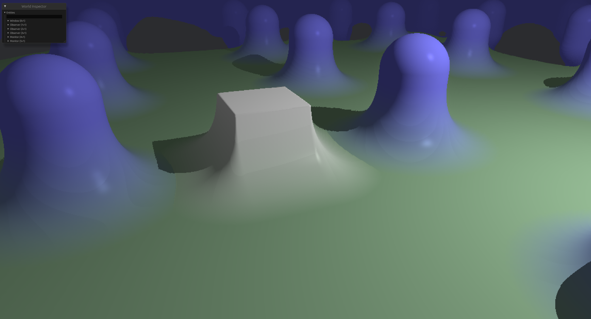
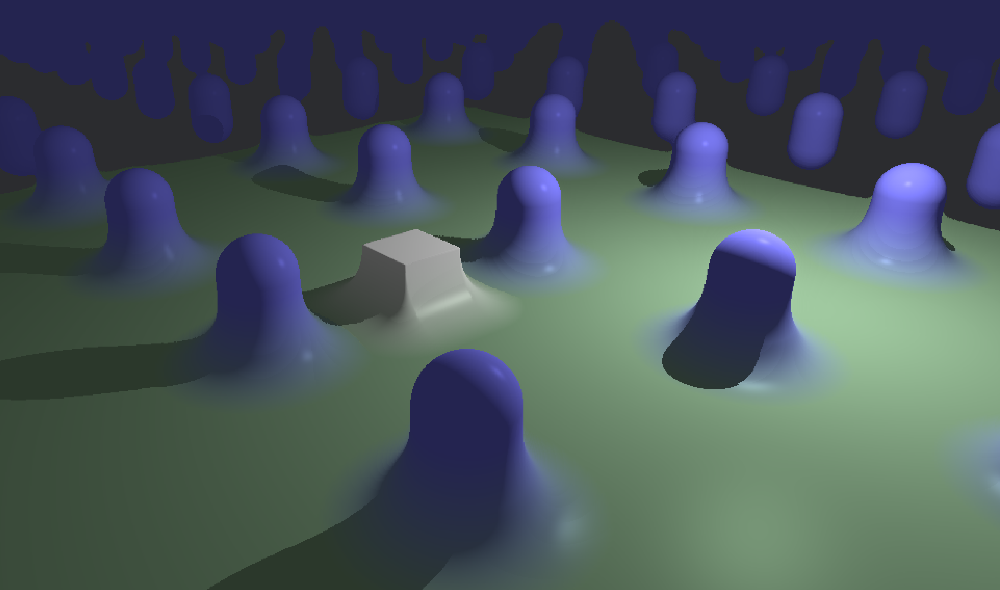
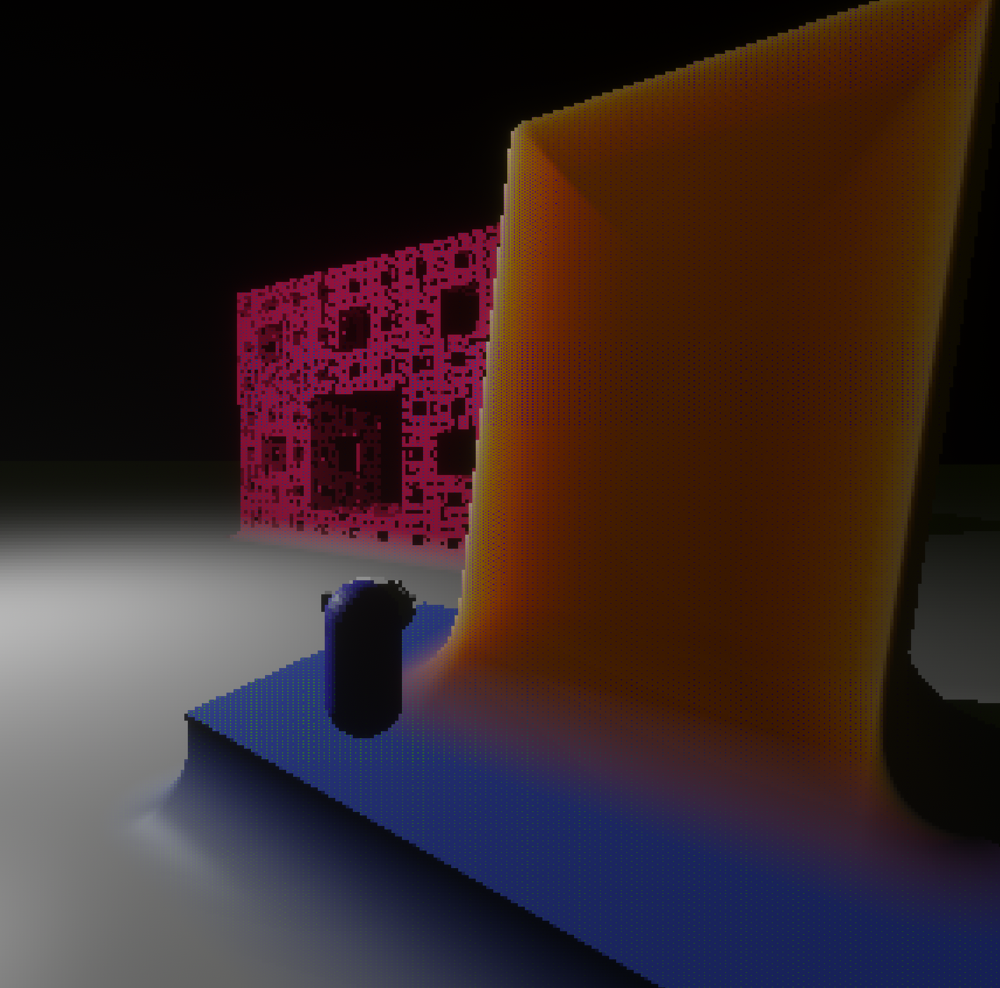
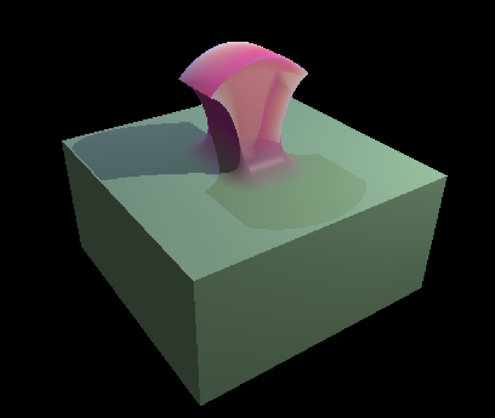

# 🌌 Bevy SDF

**Bevy SDF** is a general-purpose signed distance field (SDF) rendering plugin for [Bevy](https://bevy.org/). It supports dynamic SDF composition, material shading, and runtime scene manipulation.

---

## 🚧 Warning: Work in Progress

This crate is still under active development and **needs significant optimization** to perform well on most systems.

💡 **Any help or contributions are greatly appreciated!**

---

## ✨ Features

- ✅ Compatibility with [bevy-skein](https://bevy-skein.netlify.app/)
- ✅ Modifiable SDFs during game runtime
- ⏳ Custom hard-coded SDF shapes *(planned)*
- ⏳ Physically-Based Material (color, roughness, fresnel, metallic)
- ✅ Subsurface material shader for SDFs
- ⏳ Custom hard-coded SDF shaders *(planned)*
- ✅ SDF modifiers (e.g. union, blend, transforms)
- ✅ Fractal shapes MandelBulb, JuliaQuaternion, MengerSponge
- ⏳ Compatibility with [bevy_solari](https://github.com/bevyengine/bevy/tree/main/crates/bevy_solari) *(planned)*
- ⏳ Compatibility with WGSL shaders *(planned)*
- ⏳ Shape instancing *(planned)*
- ⏳ Dynamic `SdOp` capacity (currently hardcoded)

---

## Compatibility

| bevy_sdf | bevy |
|----------|------|
|0.2       | 0.17 |
|0.1       | 0.16 |
---

## Showcases

---

### Screenshots from the simple scene example

> view with `cargo r --example simple_scene`

---

### Sub Surface Scattering

> view with `cargo r --example sss_material`

---

### Video from my games where im using this crate

## 🔗 Other Raymarchers for Bevy

If you're into SDFs or ray marching, check out:

- [`bevy_march`](https://github.com/NiseVoid/bevy_march) — a fast and capable alternative ray marcher.
